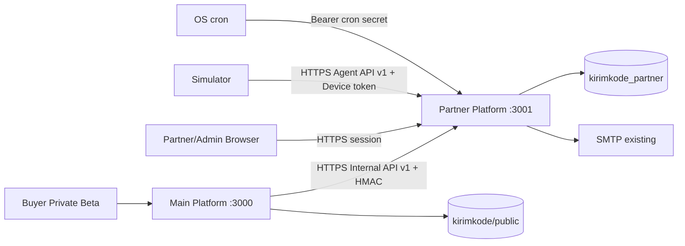
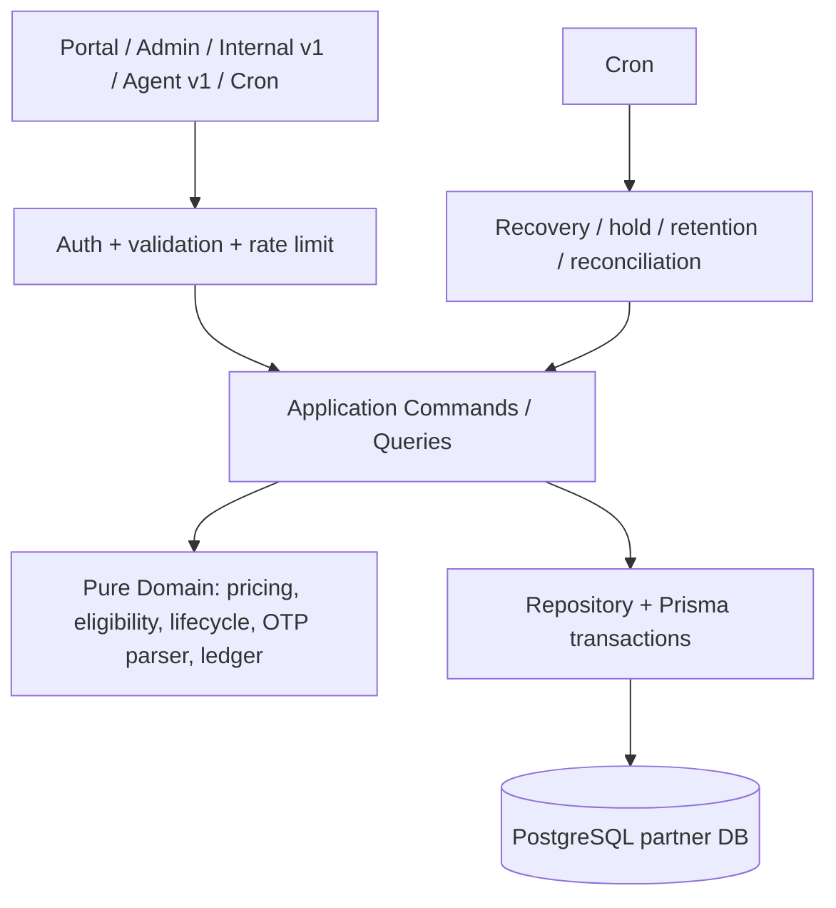
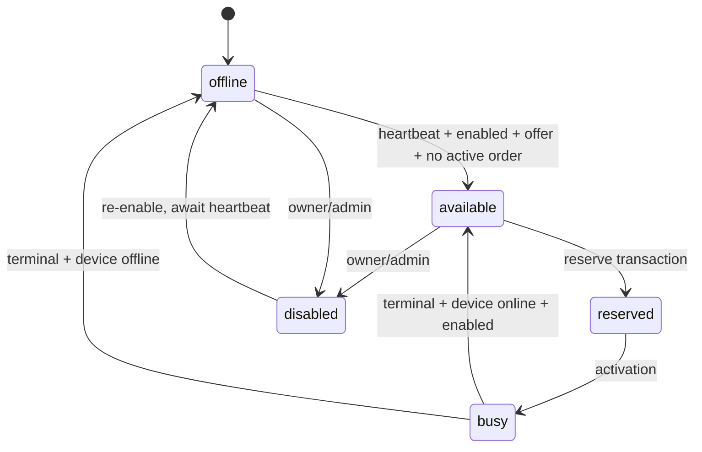
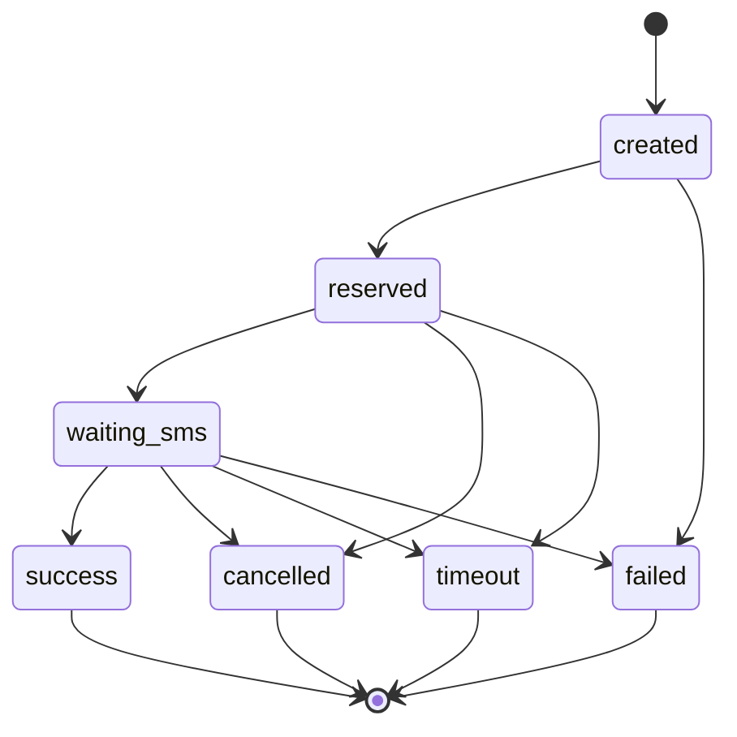

# Design Document — Partner Platform

## Overview

Partner Platform adalah aplikasi Next.js mandiri untuk onboarding supplier, inventory nomor, penerimaan SMS simulator, order, ledger earning, dan payout manual. MVP hanya membuktikan satu alur simulator end-to-end; APK, modem/GoIP, direct API publik, routing kualitas, multi-negara, dan payout otomatis tetap menjadi roadmap pasca-MVP.

Desain ini mengunci keputusan terbuka pada `requirements.md` dan `.agents/PARTNER-PROJECT-INFO.md`. Dasar riset lokal yang dipakai adalah arsitektur/deployment existing pada `.agents/PROJECT-INFO.md`, pola dispatcher di `src/lib/otp.ts`, daftar planet di `src/data/services.ts`, pricing/timeout di `src/lib/pricing.ts`, dan skema existing di `prisma/schema.prisma`. Temuan pentingnya: Main Platform sudah memiliki lifecycle dan migration `public` sendiri, adapter provider dikumpulkan di dispatcher, `Order.orderId` masih `Int`, dan refund buyer dimiliki Main Platform. Karena itu integrasi partner harus berupa adapter additive, referensi order string baru, dan saga terrekonsiliasi—bukan akses silang tabel atau distributed transaction.

### Sasaran MVP

Alur penerimaan MVP adalah: Partner approved → simulator online → satu nomor `+62` available → offer WhatsApp/Indonesia/any aktif → buyer allowlist memesan melalui Pluto → nomor terkunci → SMS simulasi diterima → OTP valid → order success → earning pending → hold selesai → payout bank manual dibayar dan dapat direkonsiliasi.

### Keputusan Final MVP

| Area | Keputusan final |
|---|---|
| Repository/deployment | Repository private `Crazyssh/kirimkode-partner`, folder `/var/www/kirimkode-partner`, Next.js mandiri, port `3001`, PM2 `kirimkode-partner`, build/output/env/log mandiri. Portal `partner.kirimkode.com`; Agent API dan Internal API di `partner-api.kirimkode.com`. |
| Database | Database PostgreSQL terpisah `kirimkode_partner` pada server PostgreSQL 17 yang sama, role `kirimkode_partner_app` dengan hak hanya ke database itu. Bukan schema di database `kirimkode`. |
| Migration | `kirimkode-partner/prisma/schema.prisma` dan `kirimkode-partner/prisma/migrations` adalah satu-satunya sumber kebenaran database partner. Repo Main tetap satu-satunya pemilik migration database `kirimkode`; tidak ada repo yang menjalankan migration milik repo lain. |
| Provider Main | ID internal `partner`, nama display **Pluto (Private Beta)**. Tidak masuk `unified`/Bimasakti pada MVP dan tersembunyi di balik flag serta allowlist. |
| Katalog MVP | `serviceCode=wa` (WhatsApp via SMS), `countryCode=ID`, `operatorCode=any`, mata uang `IDR`, nomor E.164 `+62`. |
| Waktu | Heartbeat 30 detik, offline setelah 90 detik, sweep 30 detik; order timeout 20 menit; cancel manual paling cepat 3 menit; reservation recovery 30 detik. Semua waktu disimpan UTC dan ditampilkan `Asia/Jakarta`. |
| Harga | Base price awal Rp1.000; guardrail Rp500–Rp5.000; retail = pembulatan ke atas Rp50 dari `base + Rp250 + 15% × base`; payout snapshot = base. Seluruh nominal integer IDR. |
| Finansial | Hold earning 24 jam. Minimum payout private beta Rp1.000. Payout MVP hanya transfer bank manual dan mengunci seluruh earning terpilih (tanpa partial allocation). |
| Retensi | SMS mentah 7 hari; OTP sampai 24 jam setelah terminal; metadata heartbeat 30 hari; security log 90 hari; audit dan ledger/payout 7 tahun. |
| Eksekusi async | MVP memakai cron endpoint terautentikasi yang memanggil application service idempotent berbasis lease DB. Tidak ada state penting di memory. Worker terpisah hanya pasca-MVP. |
### Scope dan Non-Scope

**Dalam MVP:** autentikasi partner, approval manual, owner/member, admin partner, simulator, satu nomor/offer, Internal API v1, Agent API v1, parser OTP service-specific, ledger append-only, hold 24 jam, payout bank manual, audit, retention, reconciliation, metrics dasar, dan adapter Pluto private beta di Main Platform.

**Pasca-MVP:** APK Android, Gammu/modem/GoIP, direct supplier API/webhook, notification listener WhatsApp, resend, weighted routing, multi-partner optimization, KYC otomatis, payout gateway, multi-currency, multi-country/operator/service, queue broker, worker/service Agent terpisah, multi-server, dan Bimasakti inclusion.

## Architecture

### Konteks Sistem dan Isolasi



Main dan Partner tidak berbagi process, `.next`, PM2, environment, session secret, service secret, device secret, log, atau Prisma Client. Keduanya hanya berbagi host PostgreSQL pada tahap awal. Role database tidak memperoleh `CONNECT`/privilege ke database aplikasi lain. Backup server mencakup kedua database sebagai artefak terpisah; restore partner tidak boleh menghentikan atau mengganti database Main.

Nginx mengarahkan `partner.kirimkode.com` ke portal dan `partner-api.kirimkode.com` ke `/api/agent/v1/*` serta `/api/internal/v1/*`. Endpoint produksi menolak HTTP dan trusted proxy dikonfigurasi eksplisit. `/api/health/live` publik hanya mengembalikan process health; `/api/health/ready` menguji DB secara dangkal tanpa secret atau detail skema.

### Batas Kepemilikan Data dan Migration

- **Partner DB:** seluruh Partner, member, device, number, offer, partner order, SMS, idempotency, earning, ledger, payout, config, audit, lease, dan reconciliation issue.
- **Main DB:** buyer, saldo buyer, order buyer, refund buyer, private-beta allowlist/flag, serta link/reference Pluto.
- Main tidak membaca Partner DB; Partner tidak membaca user/saldo/order Main DB. Identitas lintas batas hanya opaque `buyerOrderRef` dan `buyerAccountRef` (pseudonymous UUID), bukan foreign key lintas database.
- Perubahan Main bersifat additive: tambahkan server ID `partner`, `providerOrderRef String?`, `providerRequestRef String?`, dan tabel operasi/kompensasi bila diperlukan. Tidak mengubah atau menghapus provider/order/migration existing.
- Pipeline partner hanya menjalankan `prisma migrate deploy` dari repo partner terhadap `kirimkode_partner`. CI menolak SQL destructive (`DROP`, truncate, penghapusan kolom) untuk fase MVP kecuali prosedur perubahan terpisah yang disetujui.

### Layer Aplikasi



Route hanya menangani transport. Semua aturan lifecycle berada pada pure domain functions dan application commands yang dipakai bersama portal, API, simulator, admin, dan job. Prisma repository menerapkan tenant predicate serta transaksi. Ini menjaga Agent API tetap netral terhadap tipe device dan memungkinkan worker terpisah nanti tanpa mengubah lifecycle inti.

### Boundary Async dan Recovery

MVP tidak membutuhkan message broker. Job `offline-sweep`, `order-timeout`, `reservation-recovery`, `earning-release`, `retention-redaction`, dan `reconcile` dipicu cron tiap menit (offline sweep boleh dua kali per menit) melalui endpoint dengan secret khusus. Setiap batch mengambil lease DB, memakai `FOR UPDATE SKIP LOCKED`/conditional update, memiliki `operationKey` unik, dan aman dijalankan ulang setelah crash. Pasca-MVP job yang sama dapat dipindah ke process worker karena interface command dan tabel lease tidak berubah.
## Components and Interfaces

### 1. Human Authentication dan Authorization

Partner menggunakan email/password terpisah dari akun buyer. Password 12–128 karakter di-hash Argon2id (parameter minimum: memory 64 MiB, iterations 3, parallelism 1; dapat dinaikkan tanpa reset). Email dinormalisasi lowercase dan unik. Registrasi membuat `Partner(pending)` dan `PartnerMember(owner)` dalam satu transaksi.

Session adalah opaque random 256-bit dalam cookie `__Host-partner_session` (`Secure`, `HttpOnly`, `SameSite=Lax`, path `/`), hash token disimpan di DB, idle TTL 12 jam dan absolute TTL 7 hari. Session memuat `memberId`, `partnerId`, role, dan security version; setiap query tenant mengambil `partnerId` hanya dari session. Resource tenant lain diperlakukan `404 RESOURCE_NOT_FOUND`. Partner Admin memakai akun/role global terpisah dan route `/admin`; tidak pernah menyamar sebagai partner tanpa audit.

Email verification token hidup 24 jam, reset password 60 menit, keduanya 256-bit, disimpan sebagai SHA-256 hash, sekali pakai, dan token lama diinvalidasi saat token baru dipakai. Login dibatasi 5 kegagalan/15 menit per email+IP lalu cooldown 15 menit; register/verifikasi/reset 5 request/jam per email dan 20/jam per IP. Respons auth generik dan audit tidak memuat token/password.

Matriks izin MVP:

| Operasi | owner | member | Partner Admin |
|---|---:|---:|---:|
| Lihat operasional tenant | Ya | Ya | sesuai izin admin |
| Kelola device/number/offer | Ya | Ya | disable/recovery |
| Kelola anggota/API key/tujuan payout | Ya | Tidak | Tidak melihat secret |
| Ajukan payout | Ya | Tidak | review saja |
| Approve/suspend/config/reconcile | Tidak | Tidak | Ya |

### 2. Domain Config dan Pricing

`PlatformConfig` terversi menyimpan guardrail, fee, markup bps, round unit, timeout, cancel minimum, heartbeat interval/timeout, hold, minimum payout, retention, dan simulator allowlist. Update admin tervalidasi dan diaudit. Order selalu menyimpan `configVersion` dan snapshot; perubahan config hanya memengaruhi reservasi berikutnya.

```ts
interface PricingInput { basePriceIdr: number; fixedFeeIdr: number; markupBps: number; roundToIdr: number }
interface PricingResult { retailPriceIdr: number; payoutIdr: number; platformMarginIdr: number }
// retail = ceilTo(base + fixedFee + ceil(base * bps / 10_000), roundTo)
// payout = base; margin = retail - payout
```

Offer di luar Rp500–Rp5.000 ditolak pada MVP (`PRICE_OUT_OF_GUARDRAIL`), bukan ditahan, agar tidak ada status review tambahan. Base awal Rp1.000 menghasilkan retail Rp1.400 dan payout Rp1.000. Client hanya mengirim base; retail/payout selalu dihitung server.

### 3. Inventory dan Reservation Service

Eligibility adalah konjungsi: partner approved, device online dan tidak disabled, number available dan enabled, offer active, seluruh dimensi katalog cocok, capability `sms=true`, serta heartbeat belum stale. Candidate diurutkan deterministik `number.id ASC` untuk MVP; kualitas/routing berbobot ditunda.

Reservasi memakai transaksi `READ COMMITTED` dengan row lock `FOR UPDATE SKIP LOCKED` pada candidate. Transaksi membuat order/snapshot/idempotency record dan mengubah number `available→reserved`; unique partial constraint konseptual memastikan maksimal satu order aktif per number. Setelah commit, command activation CAS mengubah `reserved→waiting_sms` dan number `reserved→busy`. Respons sukses hanya diberikan setelah activation; recovery mempromosikan reservation yang tertinggal lebih dari 30 detik atau melepasnya jika tidak valid.

### 4. Internal API v1

Base path: `https://partner-api.kirimkode.com/api/internal/v1`. JSON UTF-8, HTTPS, `Content-Type: application/json`, timeout client Main 3 detik untuk query dan 8 detik untuk mutation. Contract backward-compatible dalam `/v1`; field baru optional, breaking change memakai `/v2`.

Autentikasi HMAC-SHA256 memakai secret khusus Main yang disimpan di env kedua aplikasi (current+previous saat rotasi). Header: `X-KK-Client-Id`, `X-KK-Key-Id`, `X-KK-Timestamp` (Unix detik), `X-KK-Nonce` (128-bit), dan `X-KK-Signature`. Canonical string adalah method, path, timestamp, nonce, SHA-256 body, dan Idempotency-Key. Clock skew maksimum 300 detik; nonce unik 10 menit. Signature dibandingkan constant-time. Kredensial ini bukan session atau device token.

Envelope sukses: `{ "data": ..., "requestId": "uuid" }`. Envelope gagal: `{ "error": { "code": "STABLE_CODE", "message": "aman", "retryable": false }, "requestId": "uuid" }`. Status utama: 400 validation, 401 auth, 403 policy, 404 not found, 409 conflict/idempotency mismatch, 422 invalid transition, 429 rate limit, 503 dependency/internal retryable.
#### Operasi Internal API

| Method/path | Idempotency | Request inti | Response inti |
|---|---|---|---|
| `GET /inventory?service=wa&country=ID&operator=any` | Tidak | filter katalog | `available`, `retailPriceIdr`, `currency`, `quoteVersion`, `expiresAt` |
| `POST /orders/reserve` | Wajib | `buyerOrderRef`, `buyerAccountRef`, filter, `quoteVersion` | `partnerOrderId`, `number`, snapshot, `status=waiting_sms`, `expiresAt` |
| `GET /orders/{id}` | Tidak | path ID | status, OTP bila tersedia, terminal reason, timestamps |
| `POST /orders/{id}/cancel` | Wajib | `reason`, `actorRef` | hasil terminal deterministik, `releaseDisposition` |
| `POST /orders/{id}/timeout` | Wajib | `observedAt`, `reason` | hasil terminal deterministik |
| `POST /reconciliation/orders` | Wajib | maksimal 100 pasangan ref/status | status authoritative Partner per item |

Mutation menyimpan `(scope, clientId, idempotencyKey, requestHash, statusCode, responseBody)` dalam transaksi yang sama dengan efek domain. Retry payload sama mengembalikan response pertama; hash berbeda menghasilkan `IDEMPOTENCY_CONFLICT`. Record mutation finansial disimpan 7 tahun, mutation operasional 90 hari.

`GET status` hanya mengembalikan `otp` kepada Main terautentikasi dan hanya untuk order tersebut. SMS mentah tidak pernah keluar melalui Internal API.

### 5. Saga Main Platform dan Kompensasi

Main Platform tetap pemilik charge/refund buyer; Partner Platform hanya pemilik reservation dan earning supplier. Tidak ada distributed transaction.

```mermaid
sequenceDiagram
  participant M as Main
  participant MD as Main DB
  participant P as Partner API
  participant PD as Partner DB
  M->>MD: tx: conditional debit + create dispatch(pending)
  M->>P: reserve(key=dispatch.reserveKey)
  P->>PD: tx: idempotency + lock number + order/snapshot
  P-->>M: deterministic reserve result
  alt reserve success
    M->>MD: tx: create buyer order/link + dispatch=confirmed
  else stock/error definitive
    M->>MD: tx: refund once + dispatch=compensated
  else outcome unknown
    M->>MD: dispatch=unknown; reconciliation polls by key/ref
  end
```

Main menambah tabel operasi additive dengan unique purchase key dan status `pending|confirmed|compensating|compensated|unknown`; debit/refund memakai conditional state transition dalam transaksi sehingga tepat sekali. Jika Main gagal setelah Partner reserve tetapi sebelum link tersimpan, rekonsiliasi mencari `buyerOrderRef`; reservation Partner timeout otomatis dan tidak membuat earning. Jika Main gagal setelah debit, record dispatch persisten memicu retry/kompensasi. Cancel/timeout dari kedua sisi idempotent; status Partner authoritative untuk supply, sedangkan Main authoritative untuk saldo buyer. Tidak ada refund partner-side.

Adapter Main `provider-partner.ts` memetakan response Pluto ke interface dispatcher. Karena ID Partner UUID, Main menggunakan `providerOrderRef String?`; `orderId Int` tidak dipaksa menampung UUID. Pluto tidak mengubah perilaku `api1`–`api10` atau `unified` dan tidak dipilih jika flag `partner_supply_enabled=false`, user tidak di allowlist, health gagal, atau inventory kosong.

### 6. Agent API v1 dan Simulator

Base path: `/api/agent/v1`. Kredensial format `Authorization: Device <devicePublicId>.<secret>`; secret 256-bit ditampilkan sekali dan hanya SHA-256 hash + 128-bit per-device peppered salt yang disimpan. Rotasi membuat secret baru dan langsung mencabut hash lama; grace period default nol pada MVP. Header replay: `X-Agent-Timestamp`, `X-Agent-Nonce`, dan `Idempotency-Key` untuk mutation SMS/inventory. Skew 300 detik dan nonce unik 10 menit.

| Method/path | Fungsi |
|---|---|
| `POST /heartbeat` | upsert heartbeat, agent version, signal, operator, health, capabilities |
| `POST /numbers/register` | register nomor E.164 milik device; simulator/private beta saja pada MVP |
| `POST /numbers/{id}/availability` | requested available/offline/disabled; domain tetap menentukan effective state |
| `POST /sms` | menerima `messageId`, number, sender, receivedAt, body; maksimal body 4 KiB |

Rate limit MVP: heartbeat 6/device/menit (burst 3), SMS 30/device/menit, number mutation 10/device/menit, plus 120/partner/menit dan 300/IP/menit. Payload maksimal 16 KiB. Device disabled, partner non-approved, auth/replay/ownership gagal ditolak sebelum mutation. Metadata agent divalidasi tetapi tidak pernah menentukan partner, role, harga, atau otorisasi.

Simulator bukan endpoint anonim khusus; ia memakai Agent API yang sama dengan device type `simulator`. Pembuatan simulator hanya jika environment bukan production atau `partner.simulatorAllowed=true` yang diset Admin untuk private beta. Dengan demikian simulator menjalankan domain logic yang sama dengan hardware.
### 7. Heartbeat, Offline, dan Recovery

Heartbeat ideal setiap 30 detik. Request valid menetapkan `lastSeenAt=max(existing, receivedAtServer)`, menyimpan sample metadata, dan mengubah device offline→online. Waktu client hanya metadata; waktu server menentukan liveness. Sweep setiap 30 detik mengubah device online→offline bila `now-lastSeenAt>90s`.

Saat offline, number idle `available→offline`; number `reserved/busy` tidak dialihkan ke buyer lain dan order tetap menunggu sampai timeout/cancel. Saat heartbeat pulih, number `offline→available` hanya bila enabled, mempunyai offer aktif, dan tidak punya order aktif. Jika order selesai saat device offline, number berakhir `offline`, bukan available. Reconciliation memeriksa stale online device, number tanpa/berganda order aktif, dan order-number state mismatch. Recovery admin hanya memanggil command CAS yang sama dan wajib alasan/audit.

### 8. SMS Matching dan OTP Parser

`messageId` unik per device dan `Idempotency-Key` mencegah duplicate processing. Dalam transaksi, service memvalidasi ownership device-number, menyimpan SMS terenkripsi pada level aplikasi (AES-256-GCM dengan key version dari env), lalu mencari tepat satu order `waiting_sms` aktif pada number dan window waktu yang sesuai. Nol atau lebih dari satu kandidat ditandai `unmatched|ambiguous` dan tidak mengirim OTP.

Parser MVP khusus `wa`: pesan harus memiliki keyword terkonfigurasi (`WhatsApp`, `kode`, `code`, `verification`, atau `verifikasi`) dan tepat satu kandidat angka 6 digit yang tidak merupakan bagian angka lebih panjang. Fallback hanya menerima 4–8 digit jika rule service eksplisit mengizinkannya; fallback generik mati untuk MVP. OTP disimpan terenkripsi dan fingerprint hash digunakan untuk dedupe. Pencocokan, update order success, pembuatan earning, dan ledger event dilakukan dalam satu transaksi idempotent. Raw SMS/OTP selalu disensor dari logs, traces, audit metadata, dan error.

### 9. Lifecycle dan State Machine

#### Partner

`pending→approved|rejected`; `approved→suspended`; `suspended→approved|rejected`. Rejected tidak dapat mengaktifkan inventory. Suspend menghentikan reservasi baru tetapi tidak mengubah order terminal atau menghapus ledger.

#### Device dan Number



Device effective state `offline|online|disabled`; number state `offline|available|reserved|busy|disabled`. Number tidak boleh dipindah/dihapus pada reserved/busy. Normalisasi nomor memakai E.164 dan unique `(canonicalNumber)` untuk status non-disabled pada MVP sehingga satu nomor aktif tidak dapat didaftarkan ambigu lintas partner.

#### Partner Order



Terminal adalah `success|cancelled|timeout|failed`. Success tidak dapat dibatalkan atau ditimeout. Cancel valid hanya setelah 3 menit dan sebelum OTP; internal compensation sebelum activation boleh cancel dengan reason `MAIN_COMPENSATION`. Semua transition memakai compare-and-set pada expected state, merekam actor/reason, dan retry transition sama mengembalikan state yang sudah tercapai. Terminal berbeda menghasilkan `TERMINAL_STATE_CONFLICT` tanpa efek uang kedua.

#### Earning dan Payout

Order pertama kali success membuat satu Earning pending. Setelah 24 jam tanpa dispute, `pending→available`. Payout mengunci seluruh Earning terpilih: `available→requested`; paid menghasilkan `requested→paid`. Rejected/failed mengembalikan `requested→available` secara idempotent. Reversal valid mengubah pending/available→reversed dan menambah event pembalik; earning paid tidak dapat dibalik otomatis pada MVP dan menjadi reconciliation issue untuk tindakan manual terpisah.

Payout: `requested→approved→processing→paid`; `requested|approved|processing→rejected|failed` hanya dengan alasan. Tujuan payout adalah bank transfer Indonesia: `bankCode`, `accountNumberEncrypted`, `accountNumberLast4`, `accountHolderName`. Perubahan tujuan setelah payout dibuat tidak mengubah snapshot payout. Admin mencatat `paymentReference` unik, waktu, dan metode `bank_transfer_manual`.
### 10. Ledger dan Rekonsiliasi Finansial

Ledger append-only memakai `LedgerTransaction` dan minimal dua `LedgerEntry` per event. Bucket: `platform_partner_payable`, `partner_pending`, `partner_available`, `partner_payout_locked`, `partner_paid`, `partner_reversed`. Jumlah signed entry per transaction harus nol. Contoh success Rp1.000: payable `-1000`, pending `+1000`; hold release: pending `-1000`, available `+1000`; payout lock: available `-1000`, locked `+1000`; paid: locked `-1000`, paid `+1000`.

Saldo portal dihitung dari SUM ledger entries per bucket, bukan kolom balance mutable. `eventKey` unik (`order-success:{orderId}`, `hold-release:{earningId}`, `payout-lock:{payoutId}`, dst.) membuat retry no-op deterministik. `PartnerEarning` dan `PartnerPayout` adalah projection/state untuk workflow; ledger adalah sumber kebenaran nominal. Rekonsiliasi memverifikasi zero-sum, snapshot=earning, earning unik/order, allocation unik/earning, payout amount=jumlah allocation, dan kesesuaian projection dengan ledger.

### 11. Portal, Admin, dan Private Beta

Portal menyediakan dashboard serta halaman Device, Number, Offer, order aktif/history, Earning, Payout, member, dan API key. Empty state memberi tindakan berikutnya. Nilai uang diformat IDR tanpa desimal dan timestamp `Asia/Jakarta`, sementara storage UTC. Tombol disembunyikan berdasarkan role/status tetapi server tetap melakukan authorization.

Area Admin berada di aplikasi partner dan mendukung approval/suspension, disable resource, config, payout, audit/SMS teredaksi, serta recovery. Raw SMS hanya role admin dengan permission `sms:raw`, membutuhkan reason, re-auth 15 menit, dan menghasilkan audit; OTP hanya ditampilkan untuk troubleshooting terbatas sebelum retention.

Main menyimpan `partner_supply_enabled` default false dan allowlist user UUID. Pluto hanya terlihat dan dapat dibeli jika flag aktif serta buyer terdaftar. Menonaktifkan flag menyembunyikan inventory baru tetapi status/cancel order Pluto existing tetap berjalan. Data uji tidak dihapus. MVP tidak memasukkan Pluto ke Bimasakti untuk mencegah routing tak sengaja.

### 12. Observability dan Operasi

Log JSON memuat `timestamp`, `level`, `service`, `env`, `requestId`, `route`, `method`, `status`, `latencyMs`, hashed actor/device ID, `partnerOrderId`, dan stable error code. Redaction wajib untuk authorization, cookie, password, token, API key, account number penuh, OTP, dan SMS. Security event terpisah mencatat auth gagal, replay, rate limit, ownership violation, dan admin raw-data access.

Metrik minimum: request count/error/latency per API; DB pool; eligible inventory; reservation success/stockout/conflict; order terminal/success latency; unmatched/ambiguous SMS; heartbeat age/offline device; pending/available earning; payout by state; job duration/failure; reconciliation issue. Alert MVP: readiness gagal 2 menit, error 5xx >5%/5 menit, heartbeat simulator >90 detik, order stuck >timeout+2 menit, ledger imbalance >0, payout processing >24 jam.

Health response publik hanya `{status, version, time}`. Readiness dapat mengembalikan 503 dan nama dependency generik tanpa DSN. Backup database partner harian terenkripsi mengikuti storage existing tetapi file/object terpisah; restore drill partner tidak menyentuh process/database Main.

## Data Models

Semua primary key UUID, timestamp UTC, nominal `Int` IDR dengan check `>=0`, enum direpresentasikan Prisma enum/DB enum, dan JSON hanya untuk metadata tervalidasi yang bukan sumber otorisasi.

### Tenant, Identity, Credential

- `Partner(id, legalName, displayName, status, simulatorAllowed, statusReason, approvedAt, createdAt, updatedAt)`.
- `PartnerMember(id, partnerId, emailNormalized, passwordHash, role, emailVerifiedAt, securityVersion, status, createdAt, updatedAt)`; unique email global.
- `PartnerSession(id, memberId, partnerId, tokenHash, expiresAt, idleExpiresAt, revokedAt)`.
- `OneTimeToken(id, memberId, type, tokenHash, expiresAt, usedAt)`.
- `PartnerAdmin(id, emailNormalized, passwordHash/authRef, permissions, status)` dalam realm terpisah.
- `DeviceCredential(id, deviceId, publicId, secretHash, status, createdAt, revokedAt, lastUsedAt)`; secret tidak disimpan mentah.
- `ServiceCredential(id, clientId, keyId, encryptedSecret/current env reference, status, rotatedAt)`; secret HMAC produksi diprioritaskan dari secret manager/env, bukan portal.
### Inventory dan Katalog

- `PartnerDevice(id, partnerId, type, label, effectiveStatus, disabledAt, lastSeenAt, agentVersion, capabilitiesJson, metadataJson, createdAt, updatedAt)`; type `simulator|android|modem|goip|api`.
- `DeviceHeartbeat(id, deviceId, receivedAt, signal, operator, health, agentVersion)`; dipartisi/di-prune berdasarkan retention.
- `PartnerNumber(id, partnerId, deviceId, canonicalNumber, countryCode, operatorCode, status, enabled, currentOrderId, createdAt, updatedAt)`; index eligibility dan unique active canonical number.
- `NumberStateHistory(id, numberId, fromStatus, toStatus, actorType, actorIdHash, reason, createdAt)`.
- `PartnerOffer(id, partnerId, serviceCode, countryCode, operatorCode, basePriceIdr, status, configVersion, createdAt, updatedAt)`; unique active dimension per partner pada MVP.
- `PlatformConfig(id/version, pricing fields, timeout fields, retention fields, activeFrom, createdBy)`; immutable version, satu active.

### Order, SMS, dan Idempotency

- `PartnerOrder(id, buyerOrderRef, buyerAccountRef, partnerId, numberId, offerId, status, otpCiphertext, otpKeyVersion, otpFingerprint, expiresAt, terminalReason, createdAt, reservedAt, waitingAt, succeededAt, terminalAt, version)`.
- `OrderSnapshot(orderId PK/FK, serviceCode, countryCode, operatorCode, canonicalNumber, basePriceIdr, retailPriceIdr, payoutIdr, platformMarginIdr, currency, configVersion)`; immutable setelah reserve.
- `OrderTransition(id, orderId, fromStatus, toStatus, actorType, actorRefHash, reason, operationKey, createdAt)`; unique operation key.
- `PartnerSms(id, deviceId, numberId, messageId, idempotencyKey, senderCiphertext, bodyCiphertext, keyVersion, bodyFingerprint, receivedAtDevice, receivedAtServer, matchStatus, matchedOrderId, extractedAt, redactedAt)`; unique `(deviceId,messageId)`.
- `IdempotencyRecord(id, scope, principalId, key, requestHash, responseStatus, responseJson, state, expiresAt, createdAt)`; unique `(scope,principalId,key)`.
- `ReplayNonce(id, principalId, nonceHash, expiresAt)`; unique principal+nonce.

### Ledger dan Payout

- `PartnerEarning(id, partnerId, orderId, amountIdr, status, availableAt, reversedAt, createdAt, updatedAt)`; unique `orderId`.
- `LedgerTransaction(id, partnerId, eventType, eventKey, referenceType, referenceId, createdAt)`; unique event key.
- `LedgerEntry(id, transactionId, partnerId, bucket, amountIdrSigned, createdAt)`; transaction constraint diverifikasi application+reconciliation.
- `PayoutDestination(id, partnerId, bankCode, accountNumberCiphertext, keyVersion, accountNumberLast4, accountHolderName, status, createdAt)`.
- `PartnerPayout(id, partnerId, destinationSnapshotJsonEncrypted, amountIdr, status, paymentMethod, paymentReference, requestedAt, paidAt, createdByMemberId, processedByAdminId, failureReason, version)`; unique non-null payment reference.
- `PayoutAllocation(id, payoutId, earningId, amountIdr)`; unique earningId, amount harus sama dengan earning penuh pada MVP.
- `PayoutTransition(id, payoutId, fromStatus, toStatus, actorType, actorRefHash, reason, operationKey, createdAt)`.

### Operasi, Audit, dan Retensi

- `AuditEvent(id, partnerId?, actorType, actorRefHash, action, targetType, targetId, result, safeMetadataJson, requestId, createdAt)`; append-only.
- `SecurityEvent(id, principalHash, category, result, networkHash, requestId, createdAt)`.
- `JobLease(name, ownerId, leaseUntil, cursorJson, updatedAt)`.
- `ReconciliationIssue(id, type, referenceId, severity, detailsSafeJson, status, detectedAt, resolvedAt, resolutionAuditId)`.

Relasi tenant selalu membawa `partnerId` pada aggregate yang sering di-query untuk defense in depth. Repository method untuk portal wajib menerima `TenantContext`; raw Prisma client tidak diekspor ke route/UI.
## Correctness Properties

*A property is a characteristic or behavior that should hold true across all valid executions of a system-essentially, a formal statement about what the system should do. Properties serve as the bridge between human-readable specifications and machine-verifiable correctness guarantees.*

Properti berikut adalah hasil konsolidasi prework: kriteria yang menguji invariant sama digabung agar tidak redundan, sedangkan concurrency database, deployment, UI, dan layanan eksternal tetap diuji sebagai integration/smoke/example test.

### Property 1: Registrasi tenant atomik

**For all** (untuk setiap) payload registrasi valid, hasilnya mempunyai tepat satu Partner berstatus `pending` dan tepat satu PartnerMember `owner` yang merujuk Partner tersebut; untuk setiap kegagalan transaksi, tidak satu pun dari keduanya tersimpan.

**Validates: Requirements 2.1**

### Property 2: Normalisasi identitas dan kebijakan kredensial

**For all** alamat email dan password, email yang ekuivalen setelah trim/lowercase memiliki satu identitas unik, dan registrasi hanya diterima jika password memenuhi seluruh batas kebijakan.

**Validates: Requirements 2.2**

### Property 3: Token sekali pakai berbatas waktu

**For all** token verifikasi/reset dan waktu observasi, token hanya dapat mengubah state tepat sekali ketika hash cocok, belum digunakan, dan waktu belum melewati expiry; semua kondisi lain tidak mengubah state akun.

**Validates: Requirements 2.6**

### Property 4: Isolasi tenant dan matriks izin

**For all** kombinasi session tenant, role, operasi, dan resource, hasil operasi hanya dapat memuat/mengubah resource dengan `partnerId` dari session serta hanya bila model izin mengizinkan; ID tenant lain menghasilkan respons generik dan state tetap.

**Validates: Requirements 2.4, 4.2, 4.3, 4.4**

### Property 5: Status Partner mengendalikan inventory tanpa merusak history

**For all** Partner dan urutan perubahan status valid, inventory hanya dapat diaktifkan/dipilih saat status `approved`; suspension/non-approved menghentikan reservasi baru tanpa mengubah order terminal atau riwayat resource.

**Validates: Requirements 3.1, 3.2, 3.3, 3.4, 16.4**

### Property 6: Credential dan status Device bersifat fail-closed

**For all** request perubahan inventory/SMS, bila Device disabled atau principal tidak valid maka tidak ada state domain yang berubah; setiap Device aktif selalu mempunyai effective status tepat satu dari `offline|online`, sedangkan disabled mendominasi heartbeat.

**Validates: Requirements 5.4, 5.6, 18.5**

### Property 7: Liveness heartbeat deterministik dan metadata non-otoritatif

**For all** waktu server, heartbeat history, dan metadata agent, `lastSeenAt` tidak pernah mundur dan Device enabled online tepat ketika umur heartbeat tidak melebihi 90 detik; perubahan metadata saja tidak dapat mengubah tenant, authorization, atau eligibility selain capability tervalidasi.

**Validates: Requirements 6.1, 6.2, 6.4, 21.3**

### Property 8: Device offline meniadakan eligibility

**For all** himpunan Device dan PartnerNumber, setiap nomor dari Device offline/disabled tidak terdapat dalam hasil eligible inventory, dan nomor offline hanya pulih menjadi available bila enabled, tanpa order aktif, serta offer aktif.

**Validates: Requirements 6.3**

### Property 9: Nomor kanonik unik dan state-guarded

**For all** representasi valid nomor Indonesia, normalisasi berulang idempotent dan menghasilkan E.164 yang sama untuk representasi ekuivalen; maksimal satu nomor non-disabled memakai nilai kanonik tersebut, dan nomor `reserved|busy` tidak dapat dipindah atau dihapus.

**Validates: Requirements 7.1, 7.2, 7.3, 7.4, 7.5**

### Property 10: Pricing, guardrail, dan server authority

**For all** integer base price dan config valid, offer diterima tepat ketika Rp500≤base≤Rp5.000, `retail=ceilTo(base+250+ceil(base×1500/10000),50)`, payout=base, margin=retail−payout, dan field retail/payout dari client tidak pernah memengaruhi hasil.

**Validates: Requirements 8.1, 8.2, 8.3, 8.4, 8.6**

### Property 11: Snapshot order immutable

**For all** reservasi berhasil, snapshot sama dengan dimensi offer dan hasil pricing authoritative pada saat reservasi; perubahan offer/config setelahnya tidak mengubah snapshot/order lama dan hanya muncul pada reservasi baru.

**Validates: Requirements 8.5, 9.5**

### Property 12: Pemilihan inventory hanya dari eligible set

**For all** himpunan partner, device, number, offer, capability, dan filter katalog, selector mengembalikan `null` atau satu anggota eligible set; bila set kosong hasil selalu stockout dan input/state tidak berubah.

**Validates: Requirements 9.1, 9.4, 21.5**
### Property 13: Idempotency mutation payload-bound

**For all** mutation dan jumlah retry positif, penggunaan principal, scope, Idempotency-Key, dan payload yang sama menghasilkan response pertama dan satu efek domain; key yang sama dengan hash payload berbeda selalu conflict tanpa efek tambahan.

**Validates: Requirements 9.6, 10.3, 10.4, 10.5, 20.5**

### Property 14: Error mapping stabil dan aman

**For all** domain error yang dikenal, mapper menghasilkan pasangan HTTP status, stable code, dan `retryable` yang deterministik sesuai kategori serta response tidak memuat exception internal atau nilai sensitif.

**Validates: Requirements 10.7, 20.4**

### Property 15: Ownership dan deduplikasi SMS

**For all** SMS agent, request hanya dapat diproses bila Device dan Number berada pada Partner yang sama; pengulangan `(deviceId,messageId)` atau idempotency key menghasilkan maksimal satu SMS record dan satu efek pada order.

**Validates: Requirements 11.1, 11.3**

### Property 16: Matching SMS tidak pernah ambigu

**For all** nomor dan himpunan order aktif, SMS dikaitkan hanya jika tepat satu order `waiting_sms` cocok; cardinality nol atau lebih dari satu menyimpan status audit yang tepat dan tidak mengisi OTP order mana pun.

**Validates: Requirements 11.4, 11.5**

### Property 17: Parser OTP service-specific menolak decoy

**For all** pesan WhatsApp SMS, parser hanya mengembalikan kandidat ketika keyword service valid ada dan tepat satu angka enam digit utuh ada; penambahan angka decoy, hilangnya keyword, atau kandidat ambigu tidak boleh menghasilkan OTP.

**Validates: Requirements 11.7**

### Property 18: State machine order menolak transisi ilegal

**For all** status order dan command, transition function hanya menerima edge pada state machine; semua terminal bersifat absorbing, terminal berbeda ditolak, dan pengulangan command terminal yang sama tidak menghasilkan efek baru.

**Validates: Requirements 12.1, 12.3, 12.6**

### Property 19: State order dan number selalu berpasangan

**For all** aktivasi/cancel/timeout yang valid, `reserved→waiting_sms` selalu berpasangan dengan number `reserved→busy`; terminal non-success melepaskan number ke `available` bila device online/enabled atau `offline` bila tidak, dan retry mempertahankan pasangan state yang sama.

**Validates: Requirements 12.2, 12.4, 12.5**

### Property 20: Success menghasilkan tepat satu Earning

**For all** PartnerOrder dan jumlah pengulangan event OTP valid, perubahan pertama ke success menghasilkan tepat satu Earning pending dengan amount sama dengan payout snapshot dan event berikutnya tidak membuat Earning/ledger event tambahan.

**Validates: Requirements 13.1, 13.7**

### Property 21: Hold Earning berbatas waktu

**For all** Earning pending dan waktu observasi, Earning berubah ke available tepat ketika `now>=availableAt` dan tidak ada dispute/reversal; sebelum itu status dan ledger tetap pending.

**Validates: Requirements 13.2, 13.4**

### Property 22: Ledger konservatif dan append-only

**For all** urutan event finansial valid, jumlah signed entry setiap LedgerTransaction adalah nol, saldo projection sama dengan SUM bucket ledger, dan reversal hanya menambah transaksi pembalik tanpa mengubah/menghapus transaksi asli.

**Validates: Requirements 13.5, 13.6**

### Property 23: Payout mengunci whole Earning tepat sekali

**For all** pilihan Earning, payout hanya dapat dibuat jika seluruh Earning available, unlocked, totalnya minimal Rp1.000, dan amount sama jumlah pilihan; setiap Earning muncul maksimal pada satu allocation sehingga payout paralel tidak dapat membayar Earning yang sama dua kali.

**Validates: Requirements 14.1, 14.3, 14.6**

### Property 24: Kegagalan payout membuka lock secara idempotent

**For all** payout belum paid, pengulangan transisi rejected/failed menghasilkan tepat satu unlock ledger event dan mengembalikan seluruh Earning terkait ke available tanpa mengubah total nilai ledger.

**Validates: Requirements 14.5**

### Property 25: Policy konfigurasi selalu menjaga invariant

**For all** kandidat PlatformConfig, config hanya dapat diaktifkan bila nilai guardrail terurut, timeout positif, cancel minimum lebih kecil dari order timeout, heartbeat timeout lebih besar dari interval, retention tidak negatif, dan minimum payout positif.

**Validates: Requirements 16.5, 19.4**
### Property 26: Simulator dan tipe Device ekuivalen pada domain inti

**For all** tipe Device dengan capability set yang sama dan urutan command domain yang sama, hasil lifecycle order/number setara; pembuatan simulator hanya diizinkan oleh policy environment atau allowlist dan tidak memberi hak tambahan.

**Validates: Requirements 17.1, 17.2, 21.1, 21.4**

### Property 27: Private beta gating reversibel

**For all** buyer, feature flag, dan allowlist, Pluto dapat ditemukan/dipesan tepat ketika flag aktif dan buyer diizinkan; menonaktifkan flag menghapus eligibility baru tanpa mengubah data atau lifecycle order existing.

**Validates: Requirements 17.4, 17.6, 22.7**

### Property 28: Replay validation menerima hanya request fresh dan unik

**For all** timestamp dan nonce request Agent, validator menerima request hanya bila autentikasi valid, skew maksimum 300 detik, dan nonce belum digunakan principal itu; duplicate/stale request ditolak sebelum mutation.

**Validates: Requirements 18.4, 18.5**

### Property 29: Audit event lengkap dan least privilege

**For all** command sensitif yang selesai, audit event selalu memiliki actor, action, target, waktu, hasil, dan metadata aman; akses raw SMS hanya diizinkan untuk permission `sms:raw` dengan re-auth dan reason.

**Validates: Requirements 19.1, 19.2, 19.3**

### Property 30: Retention meredaksi data sensitif tanpa merusak bukti finansial

**For all** dataset dan waktu retention, job hanya meredaksi/menghapus raw SMS setelah 7 hari, OTP 24 jam setelah terminal, heartbeat setelah 30 hari, dan security log setelah 90 hari; audit serta ledger/payout yang berumur kurang dari 7 tahun dan seluruh invariant finansial tetap utuh.

**Validates: Requirements 19.4, 19.5**

### Property 31: Reconciliation mendeteksi pelanggaran invariant

**For all** state valid yang diinjeksi tepat satu pelanggaran—order-number mismatch, duplicate earning/allocation, ledger tidak zero-sum, payout mismatch, atau stale state—reconciler menghasilkan issue dengan tipe/reference yang tepat dan tidak memperbaiki uang secara diam-diam.

**Validates: Requirements 20.2, 20.6**

### Property 32: Format portal deterministik

**For all** nominal integer IDR dan timestamp valid, formatter menghasilkan mata uang tanpa pecahan dan waktu `Asia/Jakarta` secara deterministik tanpa mengubah nilai sumber UTC.

**Validates: Requirements 15.4**

## Error Handling

### Prinsip

1. Validasi transport dilakukan sebelum domain command; autentikasi, replay, ownership, dan authorization gagal secara fail-closed.
2. Error expected memakai stable code, bukan parsing message exception. Error unexpected mendapat `INTERNAL_ERROR` dan `requestId`; stack hanya di log teredaksi.
3. Retry hanya untuk error `retryable=true`, memakai backoff+jitter dan Idempotency-Key yang sama. Client tidak retry validation/auth/conflict secara buta.
4. Mutation uang/state menyimpan idempotency result dalam transaksi efek. Ketidakpastian jaringan diperlakukan `outcome unknown`, lalu status/reconciliation—bukan mengirim command baru dengan key baru.
5. Admin recovery tidak mengedit row langsung; selalu melalui command CAS, operation key, reason, dan audit.

### Stable Error Codes

| Code | HTTP | Retryable | Arti/tindakan |
|---|---:|---:|---|
| `VALIDATION_ERROR` | 400 | Tidak | Payload/schema/ukuran salah. |
| `AUTHENTICATION_FAILED` | 401 | Tidak | Credential/signature tidak valid; respons generik. |
| `REPLAY_REJECTED` | 401 | Tidak | Timestamp/nonce duplikat atau stale. |
| `FORBIDDEN` | 403 | Tidak | Role/status/policy tidak mengizinkan. |
| `RESOURCE_NOT_FOUND` | 404 | Tidak | Resource tidak ada atau lintas tenant. |
| `IDEMPOTENCY_REQUIRED` | 400 | Tidak | Mutation tanpa key. |
| `IDEMPOTENCY_CONFLICT` | 409 | Tidak | Key dipakai payload berbeda. |
| `STATE_CONFLICT` | 409 | Tergantung | CAS/resource sedang berubah. |
| `TERMINAL_STATE_CONFLICT` | 422 | Tidak | Terminal berbeda sudah tercapai. |
| `OUT_OF_STOCK` | 409 | Tidak | Tidak ada inventory eligible; bukan internal error. |
| `PRICE_OUT_OF_GUARDRAIL` | 422 | Tidak | Base di luar Rp500–Rp5.000. |
| `CANCEL_NOT_ALLOWED` | 422 | Tidak | Terlalu awal/sudah success. |
| `RATE_LIMITED` | 429 | Ya setelah delay | Sertakan `Retry-After`. |
| `DEPENDENCY_UNAVAILABLE` | 503 | Ya | DB/SMTP/dependency sementara gagal. |
| `INTERNAL_ERROR` | 500 | Mungkin | Gunakan requestId; jangan bocorkan detail. |
### Failure Scenarios

- **Partner API timeout setelah reserve:** Main mempertahankan dispatch `unknown`, query/reconcile memakai `buyerOrderRef` dan reserve key yang sama. Jangan langsung refund sekaligus membuat reserve baru.
- **Main debit berhasil, reserve stockout:** conditional compensation mengembalikan saldo tepat sekali dan menandai dispatch compensated.
- **Main crash setelah Partner reserve:** Partner reservation/order timeout; Main reconciliation menemukan outcome. Tidak ada Earning karena belum success.
- **Crash saat SMS success:** transaksi mencakup SMS match, order success, Earning, dan ledger. Commit menghasilkan semuanya; rollback menghasilkan tidak satu pun; retry message aman.
- **Crash saat payout:** allocation/lock dan payout dibuat atomik. Mark paid memerlukan payment reference unik; retry menghasilkan response pertama.
- **Device offline:** hentikan reserve baru, pertahankan active order sampai terminal, lalu number offline. Recovery heartbeat tidak mengambil alih order lain.
- **Retention/key rotation gagal:** job berhenti pada batch gagal, menyimpan cursor aman, memunculkan metric/issue, dan retry; tidak menghapus ciphertext tanpa menjaga metadata audit.
- **Ledger mismatch:** payout/recovery finansial terkait diblokir, alert critical dibuat, dan perbaikan manual harus berupa compensating transaction—tidak update/delete entry.

## Testing Strategy

### Pendekatan

Strategi menggunakan Vitest `4.1.10` dan fast-check `4.9.0` (versi exact/pinned seperti toolchain proyek saat ini). Unit/example test menangani skenario konkret, UI, error, dan boundary; property-based test menangani invariant universal; integration test menangani PostgreSQL transaction/concurrency, API/auth, encryption, cron recovery, dan kontrak Main; smoke/E2E menguji deployment serta alur private beta.

### Property-Based Testing

- Setiap Property 1–32 diimplementasikan sebagai **satu** `fc.assert(fc.property(...))` atau `fc.asyncProperty(...)`, minimum `numRuns: 100`; parser, pricing, state machine, dan ledger ditargetkan 500 run di CI malam.
- Setiap test wajib memiliki komentar persis dengan pola `Feature: partner-platform, Property {number}: {property_text}`.
- Generator domain menghasilkan enum valid/invalid, event sequence, waktu memakai fake clock, integer IDR aman, Unicode/email/nomor, inventory graph, SMS berisi decoy, role/tenant, capability set, dan balanced ledger events.
- Pure domain test tidak memakai DB/network. Untuk idempotency application service dipakai in-memory fake repository dengan failure injection deterministik; atomicity nyata tetap integration test.
- Seed fast-check yang gagal dicetak CI agar counterexample dapat direproduksi.

Contoh bentuk test:

```ts
// Feature: partner-platform, Property 10: Pricing, guardrail, dan server authority
it("menghitung harga authoritative untuk semua base valid", () => {
  fc.assert(fc.property(fc.integer({ min: 500, max: 5_000 }), (base) => {
    const result = calculatePrice({ basePriceIdr: base, fixedFeeIdr: 250, markupBps: 1500, roundToIdr: 50 });
    expect(result.payoutIdr).toBe(base);
    expect(result.retailPriceIdr % 50).toBe(0);
    expect(result.platformMarginIdr).toBe(result.retailPriceIdr - base);
  }), { numRuns: 100 });
});
```

### Unit dan Component Tests

- Auth: hash/verify, generic login error, one-time token, policy password, session expiry.
- Pricing: nilai batas Rp499/Rp500/Rp5.000/Rp5.001 dan base Rp1.000→retail Rp1.400.
- Parser: format WhatsApp yang disetujui, Unicode, angka telepon/tanggal sebagai decoy, multiple candidates, empty/oversized body.
- Error mapper dan redaction: setiap code, header/cookie/token/OTP/raw SMS tidak muncul.
- UI portal/admin: empty state, permission-based actions, IDR/Jakarta formatting, mutation success/error, accessibility dasar.
- Lifecycle examples: cancel sebelum 3 menit, success lalu cancel, timeout saat device offline, rejected payout unlock.

### Integration dan Contract Tests

- PostgreSQL disposable database `kirimkode_partner_test`: migration dari kosong, unique/check/index, rollback injection, `FOR UPDATE SKIP LOCKED`, dan 20–100 reserve/payout paralel untuk membuktikan sukses maksimal satu.
- API: HMAC canonicalization/current+previous key, device token rotation, nonce/skew, rate limit per device/partner/IP, tenant isolation, payload 16 KiB, dan response redaction.
- Consumer-driven contract antara `provider-partner.ts` Main dan Internal API v1 untuk inventory/reserve/status/cancel/timeout/reconciliation; optional response field tidak merusak consumer.
- Saga: dependency timeout di setiap boundary debit/reserve/persist/refund, retry process, dan reconciliation sampai state konsisten tanpa double debit/refund/earning.
- Persistence/restart: restart process antara reserve-activation, SMS-success, hold-release, payout-lock, lalu jalankan job ulang.
- Migration Main pada copy database production-like memastikan hanya kolom/tabel/index additive dan provider existing tetap lulus regression suite.
- Encryption/retention: ciphertext bukan plaintext; key version terbaca; redaction sesuai fake clock; audit/ledger tetap.

### Smoke, E2E, dan Operasional

1. Build/lint/typecheck/test repo partner tanpa repo Main; deploy port 3001 dan reload PM2 partner sambil memastikan PID/process Main tidak disentuh.
2. Uji Nginx HTTPS, live/readiness, secret/env/log path terpisah, dan database grants tidak silang.
3. Matikan Partner API: halaman/provider existing Main tetap berfungsi; Pluto hilang/stockout terstruktur.
4. Jalankan E2E seed MVP: approve Partner, simulator heartbeat, register `+62`, offer `wa/ID/any`, enable buyer, reserve Pluto, submit SMS, baca OTP, cek Earning pending, advance 24 jam, request payout Rp1.000, admin paid, reconciliation zero issue.
5. Nonaktifkan private beta dan pastikan Pluto tersembunyi tetapi status/cancel order existing serta audit tetap dapat diproses.
6. Release gate mensyaratkan backup/restore drill partner, ledger zero-sum, tidak ada reconciliation issue severity high, dan APK/modem/direct API tidak diperlukan.

### Coverage Requirement Traceability

Setiap acceptance criterion memiliki test classification pada prework: property criteria dilacak ke Property 1–32; UI/config spesifik ke unit/component/smoke; concurrency, auth transport, persistence, dan integrasi Main ke integration/contract; alur Requirement 17 dan 23 ke E2E. CI wajib menjalankan unit+property+integration yang tidak membutuhkan service eksternal. E2E deployment dijalankan di staging/private-beta sebelum production.

## Roadmap Pasca-MVP (Terpisah dari Acceptance MVP)

1. **APK Android:** native Kotlin Notification/SMS forwarder, offline queue, boot recovery, capability negotiation; keputusan SMS vs notification dibuat setelah format/risiko nyata tervalidasi.
2. **Modem/GoIP:** agent Gammu pada STB Armbian, grouping node, stable port mapping, reconnect, dan heartbeat per modem sesuai `.agents/RESEARCH-MODEM-SMS.md`.
3. **Direct supplier API:** HMAC body signature, webhook, sandbox, IP allowlist opsional, batch inventory/SMS.
4. **Quality/routing:** success rate, latency, uptime, fraud signal, weighted routing, dan evaluasi masuk Bimasakti; tidak sekadar termurah.
5. **Finance/identity:** KYC, dispute workflow, automated payout, multi-currency/tax setelah payout manual dan ledger stabil.
6. **Scale:** queue broker, worker PM2 terpisah, pemisahan Agent API menjadi service ketiga, replica/partition, multi-server, dan disaster recovery lebih lanjut.

Pindah ke roadmap hanya setelah E2E simulator lulus, hasil finansial dapat direkonsiliasi, migration/restore drill berhasil, dan private-beta menunjukkan tidak ada double processing atau kebocoran data.
